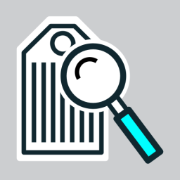

# Price Reader
 
A fun and interactive price reader simulator designed for kids

## Screenshots

<!-- 

    <kbd>
        
    </kbd>

 -->

## Questions or Suggestions

Feel free to create a <a href="https://github.com/thiagodnf/price-reader/discussions">discussion</a> as you need

## Contribute

Contributions to this project are very welcome! We can't do this alone! Feel free to fork this project, work on it and then make a pull request.

## Authors

See also the list of [contributors](https://github.com/thiagodnf/price-reader/graphs/contributors) who participated in this project.

## License

This project is licensed under the MIT License - see the [LICENSE](LICENSE) file for details

## Donate

I open-source almost everything I can, and I try to reply to everyone needing help using these projects. Obviously, this takes time. You can integrate and use these projects in your applications for free! You can even change the source code and redistribute (even resell it).

However, if you get some profit from this or just want to encourage me to continue creating stuff, there are a few ways you can do it:

 
 
Thanks! ❤️